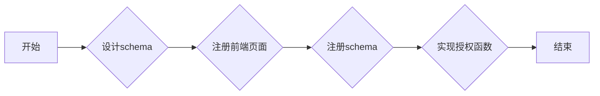

## 功能介绍
授权规则，作为系统已有认证方式的补充，它可以支持更细粒度的权限赋予。
可以支持针对用户的不同属性进行权限的赋予，例如用户名、昵称、性别、手机号等。
也可以针对分组的不同属性进行权限的赋予。
还可以根据开发者需要，通过扩展数据存储的结构，实现特定场景下权限的赋予。
## 实现思路
arkid系统已经默认实现了一个针对用户属性的权限赋予，方便开发者进行参考

下面对于实现思路做一下简单的介绍:

1. 需要开发者想清楚自己开发插件的需要筛选的属性，是用户属性，还是分组属性，或者其它属性。以及需要筛选那些应用，以及那些权限。
要设计出schema，用于存储数据结构。如果schema中有用到一些应用列表，权限列表，用户列表等，需要把用到的前端页面，使用父类的[register_front_pages](#arkid.core.extension.impower_rule.ImpowerRuleBaseExtension.register_front_pages)单独进行注册。

2. 不同的授权规则之间是通过不同的schema进行划分，所以当开发者设计完schema后，需要通过[register_impowerrule_schema](#arkid.core.extension.impower_rule.ImpowerRuleBaseExtension.register_impowerrule_schema)，进行注册。

3. 注册完成后，创建授权规则的页面绿色Type字段就会多一种授权规则，如下图所示:

    

    如果我们选择不同的授权规则，红色部分就会展示出不同的内容，展示内容由schema结构决定。

    授权规则的创建编辑和删除，都是由arkid提前处理好的，开发者只需要关注赋权方法就可以。
    
    下面对赋权方法的使用做下介绍:

    需要开发者实现[get_auth_result(event, **kwargs)](#arkid.core.extension.impower_rule.ImpowerRuleBaseExtension.get_auth_result)方法

    1. 参数: 这个方法的`kwargs`，`event` 两个参数，我们重点关注`event`参数，这个参数中包含了`data`和`tenant`两个属性，其中`event.tenant`可以获取到当前的租户；`event.data`可以获取到传递过来的数据。我们可以按到data里面的值
        1. `data.user`可以获取到当前的用户；
        2. `data.app`可以获取到当前的应用，如果这个应用是一个None，就表示应用为arkid，反之则为其它应用；
        3. `data.arr` 可以获取到用户的权限数组(0或1组成，0是没权限，1有权限，数组下标和数据库权限表里的sort_id是相同的)；4. `data.config` 可以获取到当前的授权规则
    2. 使用: 开发者需要根据授权规则`event.config`，结合`data.user`，根据自身的需求，做查找后，返回有权限的sort_id数组

## 抽象方法
* [get_auth_result(event, **kwargs)](#arkid.core.extension.impower_rule.ImpowerRuleBaseExtension.get_auth_result)

## 基类定义

::: arkid.core.extension.impower_rule.ImpowerRuleBaseExtension
    rendering:
        show_source: true

## 示例

::: extension_root.com_longgui_impower_rule.ImpowerRuleExtension
    rendering:
        show_source: true