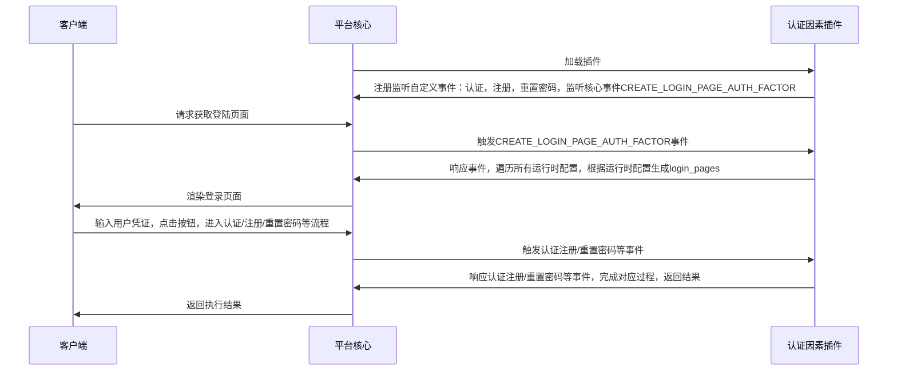

## 功能介绍

认证因素：包含手机短信验证码，用户名密码，图形验证码等具有认证或协助认证功能的一系列插件，用于鉴别用户身份或者提高系统安全性。

## 实现思路

开发者在创建新的认证因素时，需继承AuthFactorExtension基类并实现所有抽象方法，认证因素插件在运行过程中的数据流程如下图所示：

## 抽象方法

* [authenticate](#arkid.core.extension.auth_factor.AuthFactorExtension.authenticate)
* [register](#arkid.core.extension.auth_factor.AuthFactorExtension.register)
* [reset_password](#arkid.core.extension.auth_factor.AuthFactorExtension.reset_password)
* [create_login_page](#arkid.core.extension.auth_factor.AuthFactorExtension.create_login_page)
* [create_register_page](#arkid.core.extension.auth_factor.AuthFactorExtension.create_register_page)
* [create_password_page](#arkid.core.extension.auth_factor.AuthFactorExtension.create_password_page)
* [create_other_page](#arkid.core.extension.auth_factor.AuthFactorExtension.create_other_page)
* [create_auth_manage_page](#arkid.core.extension.auth_factor.AuthFactorExtension.create_auth_manage_page)

## 基类定义

::: arkid.core.extension.auth_factor.AuthFactorExtension
    rendering:
        show_source: true
    
## 示例

::: extension_root.com_longgui_auth_factor_mobile.MobileAuthFactorExtension
    rendering:
        show_source: true

::: extension_root.com_longgui_auth_factor_password.PasswordAuthFactorExtension
    rendering:
        show_source: true