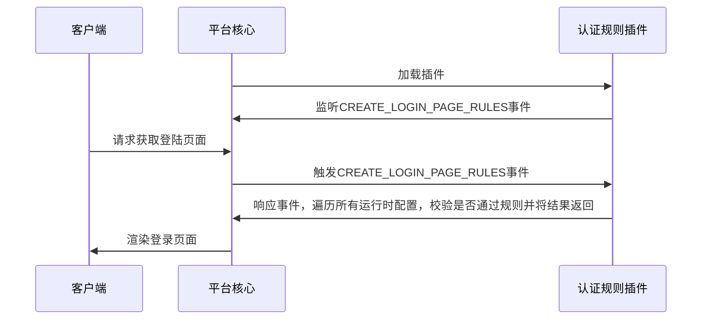

## 功能介绍

认证规则为一系列认证因素的扩充，串联一个或者多个认证因素，在指定条件下实现认证因素间的协作，以完成复杂的认证过程

## 实现思路
开发者在开发认证规则插件时，需继承AuthRuleExtension基类并重载check_rule抽象方法，监听系统事件并以事件机制串联认证因素，其基础流程如下：

## 抽象函数

* [check_rule](#arkid.core.extension.auth_rule.AuthRuleExtension.check_rule)

## 基类定义

::: arkid.core.extension.auth_rule.AuthRuleExtension
    rendering:
        show_source: true
    
## 示例

::: extension_root.com_longgui_auth_rule_retry_times.AuthRuleRetryTimesExtension
    rendering:
        show_source: true
