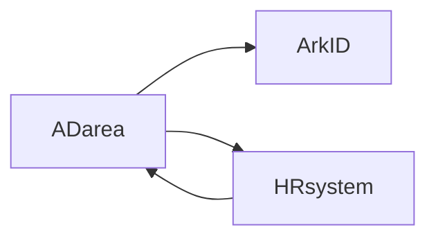

# Identity data source

## SCIMdata synchronization

User data synchronization，Use the SCIM standard protocol。

The protocol is supported in the mainstream cloud flat platform。

Generally speaking，Different systems require different plug -in to support。

The SCIM synchronization plug -in of the system comes with Arkid's self -default，Support two modes: CLIENT and Server。

Create by clicking，To add the corresponding plug -in configuration。Different plug -in configurations are different，Please refer to your own documentation。

Through ARKID，Other systems can be synchronized and docking，Instead of passing ARKID's database。

* List Click the menu "Identity data source>SCIM data synchronization"

* create Click the menu "Identity data source>SCIM data synchronization>create"

* edit Click the menu "Identity data source>SCIM data synchronization>Choose a record>Click Edit"

* delete Click the menu "Identity data source>SCIM data synchronization>Choose a record>Click to delete"

## Permanent data synchronization

In order to achieve the purpose of unified authority management，Synchronization of permission data is not lost in the same way。

ArkIDCustomized a set of standard data models to synchronize permission data。Docking other systems requires plug -in to transform the data of each system into this standard model，Then write it to Arkid。Or transform this standard model into data in other systems。

Similar to SCIM protocol，Direct docking of other systems also supports other systems。
