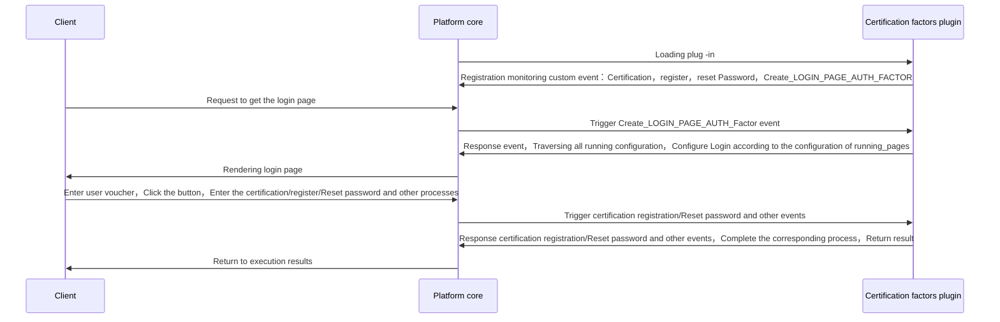

## Features

Authentication：Including mobile phone SMS verification code，Username Password，A series of plug -in with graphics verification code, etc.，Used to identify user identity or improve system security。

## Implementation

When developers create a new authentication factors，You need to inherit the AuthFactorextension base class and implement all abstract methods，The data process of the certification factor plug -in during operation is shown in the figure below：

## Abstract method

* [authenticate](#arkid.core.extension.auth_factor.AuthFactorExtension.authenticate)
* [register](#arkid.core.extension.auth_factor.AuthFactorExtension.register)
* [reset_password](#arkid.core.extension.auth_factor.AuthFactorExtension.reset_password)
* [create_login_page](#arkid.core.extension.auth_factor.AuthFactorExtension.create_login_page)
* [create_register_page](#arkid.core.extension.auth_factor.AuthFactorExtension.create_register_page)
* [create_password_page](#arkid.core.extension.auth_factor.AuthFactorExtension.create_password_page)
* [create_other_page](#arkid.core.extension.auth_factor.AuthFactorExtension.create_other_page)
* [create_auth_manage_page](#arkid.core.extension.auth_factor.AuthFactorExtension.create_auth_manage_page)

## Foundation definition

::: arkid.core.extension.auth_factor.AuthFactorExtension
    rendering:
        show_source: true
    
## Exemplary

::: extension_root.com_longgui_auth_factor_mobile.MobileAuthFactorExtension
    rendering:
        show_source: true

::: extension_root.com_longgui_auth_factor_password.PasswordAuthFactorExtension
    rendering:
        show_source: true
