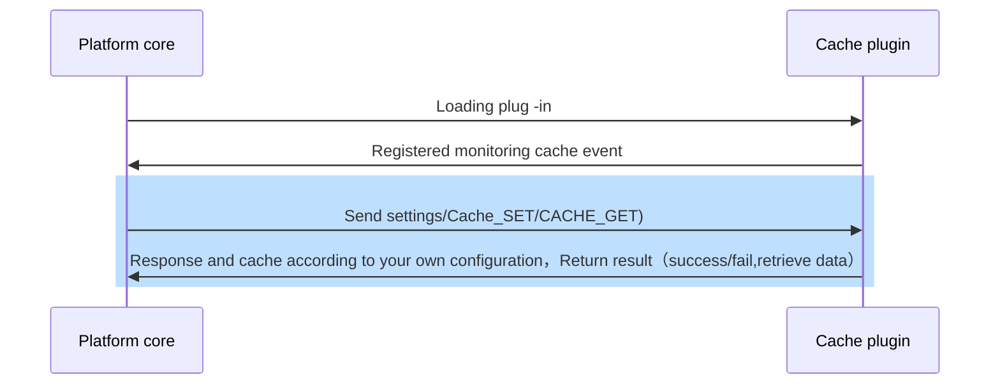

## Features

The cache plug -in provides the platform with cache function，That is, developers introduce cache databases such as redis such as Redis and using cache databases and use them to complete cache transactions through cache plugins。

## Implementation
When developing cache plug -in，Only inherit the cache plug -in base class and reload the GET/Set function，The processing process is as follows：



## How to use
The example is as follows：
``` python

from arkid.common import cache #Introduce platform cache

cache.set(tenant,key,value,expired) # The parameter is in order：Tenant，Cache key, Cache Value, Expiration

cache.get(tenant,key) #The parameter is in order：Tenant，Cache key

```

## Abstract function

* [get](#arkid.core.extension.cache.CacheExtension.get)
* [set](#arkid.core.extension.cache.CacheExtension.set)

## Foundation definition

::: arkid.core.extension.cache.CacheExtension
    rendering:
        show_source: true
