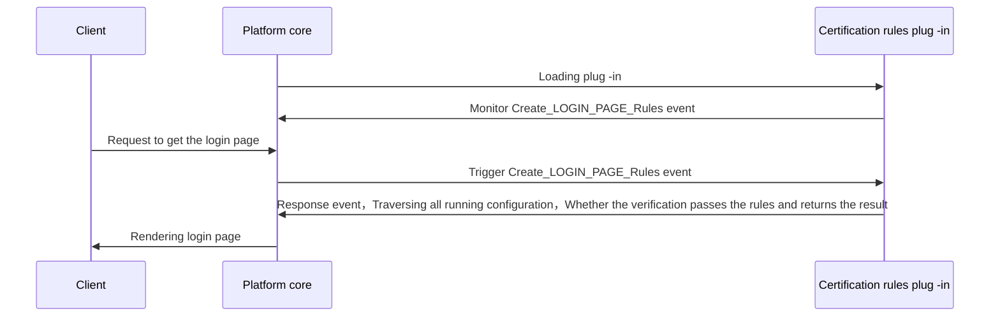

## Features

Certification rules are the expansion of a series of certification factors，One or more authentication factors in series，Implement collaboration between certification factors under the specified conditions，To complete the complex certification process

## Implementation
When developing certification rules plug -in，You need to inherit the AuthruleExtension base class and re -load check_Rule abstraction method，System events and event mechanisms are connected in series authentication factors，The basic process is as follows：

## Abstract function

* [check_rule](#arkid.core.extension.auth_rule.AuthRuleExtension.check_rule)

## Foundation definition

::: arkid.core.extension.auth_rule.AuthRuleExtension
    rendering:
        show_source: true
    
## Exemplary

::: extension_root.com_longgui_auth_rule_retry_times.AuthRuleRetryTimesExtension
    rendering:
        show_source: true
