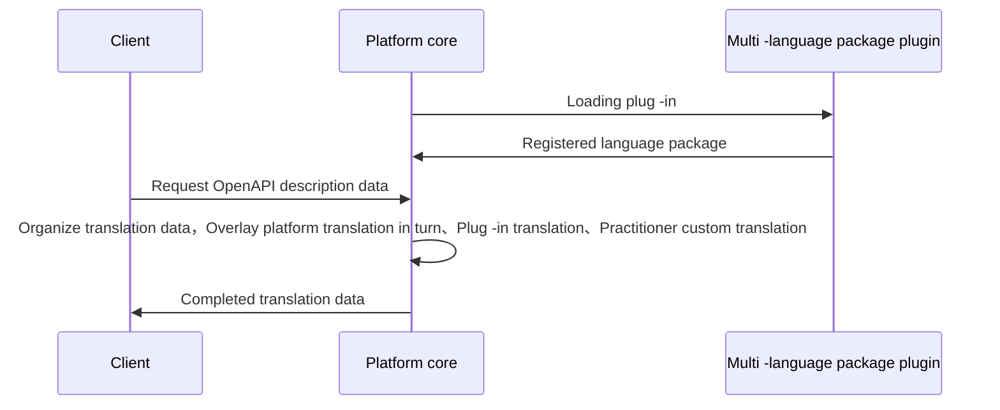

## Features
Multi -language package plug -in implementation data to ARKID registered language translation data function，Developers only need to provide the dictionary and corresponding language name after the translation is completed to complete the multi -language internationalization configuration function。
## Implementation
When developing a multi -language package plug -in，Only inherit the multi -language plug -in base class and re -load LANGUAGE_type与language_Data two functions can be，The platform will integrate data in the plug -in into the platform translation data，Distributed to the front end through OpenAPI description，You can get the corresponding data on the front page to complete the international function。

<b>Notice:</b> A language package plug -in only supports one language translation data，At the same time Database custom translation data > Plug -in translation data > The platform comes with translation data




The example is as follows：

``` py
    class TranslationZhExtension(LanguageExtension):

        def language_type(self) -> str:
            return _("Simplified Chinese")
        
        def language_data(self) -> dict:
            return {
                "data":"data"
            }
    
```
## Abstract function

* [language_type](#arkid.core.extension.language.LanguageExtension.language_type)
* [language_data](#arkid.core.extension.language.LanguageExtension.language_data)

## Foundation definition

::: arkid.core.extension.language.LanguageExtension
    rendering:
        show_source: true
    
## Exemplary

::: extension_root.com_longgui_language_zh.TranslationZhExtension
    rendering:
        show_source: true
