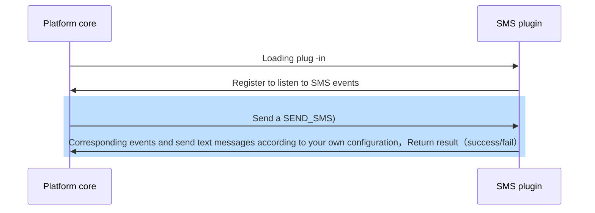

## Features

SMS plug -in abstract processing authentication process such as mobile phone verification code/Notice and other SMS sending requirements process，In order to facilitate developers to access the SMS services provided by major manufacturers through heavy loading functions

## Implementation
When developing SMS plug -in，Only inherit the SMS plug -in base class and load send_SMS function can，The processing process is as follows：

## Abstract function

* [send_sms](#arkid.core.extension.sms.SmsExtension.send_sms)

## Foundation definition

::: arkid.core.extension.sms.SmsExtension
    rendering:
        show_source: true
    
## Exemplary

::: extension_root.com_longgui_sms_aliyun.AliyunSMSExtension
    rendering:
        show_source: true
