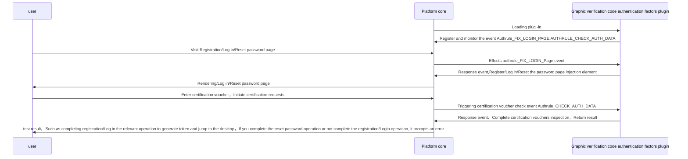

# Graphic verification code authentication factor
## Features

Expand the user certification voucher form，Insert the graphics verification code and implement the relevant verification function

<b>Notice：Graphic verification code authentication factors do not have certification/register/Modify the password and other functions，Only expand the voucher elements of other authentication factors</b>

general user：

* exist “Log in” Page implementation to the specified form insert the graph verification code

## Configuration guide

=== "Plug -in lease"
    Enter through the menu bar on the left【Tenant management】->【Plug -in management】，Find the graphical verification code authentication factor plug -in card in the plug -in lease page，Click to rent
    

=== "Tenant configuration"
    After the lease is completed，Enter the lease list，Find the graphical verification code authentication factor plug -in card，Click on the tenant configuration，Configure related data
    
    
=== "Certification factor configuration"
    Enter through the menu bar on the left【Certification management】-> 【Authentication】,Click to create button，Type selection"authcode"， No need to configure related parameters，The configuration is completed
    

## Implementation

* general user：Captcha：

## Abstract method implementation

* [load](#extension_root.com_longgui_auth_factor_authcode.AuthCodeAuthFactorExtension.load)
* [authenticate](#extension_root.com_longgui_auth_factor_authcode.AuthCodeAuthFactorExtension.authenticate)
* [register](#extension_root.com_longgui_auth_factor_authcode.AuthCodeAuthFactorExtension.register)
* [reset_password](#extension_root.com_longgui_auth_factor_authcode.AuthCodeAuthFactorExtension.reset_password)
* [create_login_page](#extension_root.com_longgui_auth_factor_authcode.AuthCodeAuthFactorExtension.create_login_page)
* [create_register_page](#extension_root.com_longgui_auth_factor_authcode.AuthCodeAuthFactorExtension.create_register_page)
* [create_password_page](#extension_root.com_longgui_auth_factor_authcode.AuthCodeAuthFactorExtension.create_password_page)
* [create_other_page](#extension_root.com_longgui_auth_factor_authcode.AuthCodeAuthFactorExtension.create_other_page)
* [create_auth_manage_page](#extension_root.com_longgui_auth_factor_authcode.AuthCodeAuthFactorExtension.create_auth_manage_page)
* [check_auth_data](#extension_root.com_longgui_auth_factor_authcode.AuthCodeAuthFactorExtension.check_auth_data)
* [fix_login_page](#extension_root.com_longgui_auth_factor_authcode.AuthCodeAuthFactorExtension.fix_login_page)

## Code

::: extension_root.com_longgui_auth_factor_authcode.AuthCodeAuthFactorExtension
    rendering:
        show_source: true

