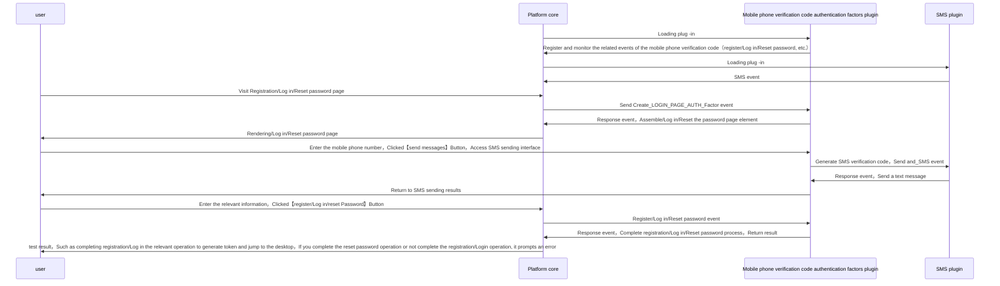
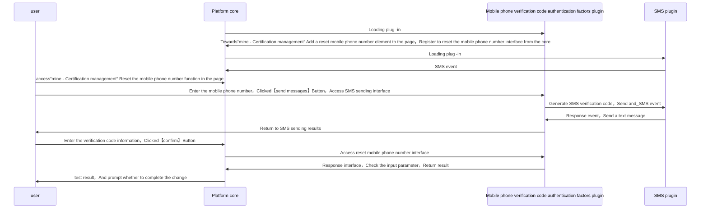
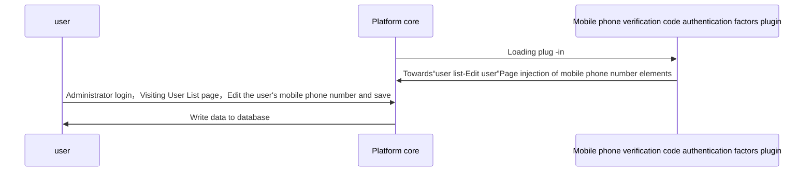

# Mobile phone verification code authentication factors
## Features

User table extension mobile phone number field，Allows users to certify through the mobile phone number and verification code，register，Reset the password and replace the mobile phone number。

general user：

* exist “register” Page implementation mobile phone number+Verification code user registration
* exist “Log in” Page implementation mobile phone number+Verification code user login
* exist “change password” Page implementation mobile phone number+The password changes at the verification code method
* exist “mine - Certification management“ Add the function of resetting the mobile phone number

Tenant administrator

* exist”User Management - user list“In the editor page adds mobile phone number editing function

## precondition

Need to be used with SMS plug -in，The system has default to provide Alibaba Cloud SMS plug -in，If you need to view the configuration method, please move the Alibaba Cloud SMS plug -in documentation。

## Configuration guide

=== "Plug -in lease"
    Enter through the menu bar on the left【Tenant management】->【Plug -in management】，Find the mobile phone verification code authentication factor plug -in card in the plug -in lease page，Click to rent
    

=== "Certification factor configuration"
    Enter through the menu bar on the left【Certification management】-> 【Authentication】,Click to create button，Type selection"mobile",Select a suitable configuration SMS plug -in when runtime.，The configuration is completed 
    

=== "login interface"
    

=== "Registration interface"
    

=== "Password modification interface"
    

=== "Replace the mobile phone number interface"
    Enter from the user avatar menu【Certification management】interface,Select the mobile phone number tab page 
    

## Implementation

* general user：mobile phone number+Verification code user registration/Log in/reset Password：

* general user：Reset the mobile phone number：

* Administrator user： Replace the user's mobile phone number

## Abstract method implementation
* [load](#extension_root.com_longgui_auth_factor_mobile.MobileAuthFactorExtension.load)
* [authenticate](#extension_root.com_longgui_auth_factor_mobile.MobileAuthFactorExtension.authenticate)
* [register](#extension_root.com_longgui_auth_factor_mobile.MobileAuthFactorExtension.register)
* [reset_password](#extension_root.com_longgui_auth_factor_mobile.MobileAuthFactorExtension.reset_password)
* [create_login_page](#extension_root.com_longgui_auth_factor_mobile.MobileAuthFactorExtension.create_login_page)
* [create_register_page](#extension_root.com_longgui_auth_factor_mobile.MobileAuthFactorExtension.create_register_page)
* [create_password_page](#extension_root.com_longgui_auth_factor_mobile.MobileAuthFactorExtension.create_password_page)
* [create_other_page](#extension_root.com_longgui_auth_factor_mobile.MobileAuthFactorExtension.create_other_page)
* [create_auth_manage_page](#extension_root.com_longgui_auth_factor_mobile.MobileAuthFactorExtension.create_auth_manage_page)
* [check_auth_data](#extension_root.com_longgui_auth_factor_authcode.AuthCodeAuthFactorExtension.check_auth_data)
* [fix_login_page](#extension_root.com_longgui_auth_factor_authcode.AuthCodeAuthFactorExtension.fix_login_page)

## Code

::: extension_root.com_longgui_auth_factor_mobile.MobileAuthFactorExtension
    rendering:
        show_source: true

::: extension_root.com_longgui_auth_factor_mobile.sms
    rendering:
        show_source: true

