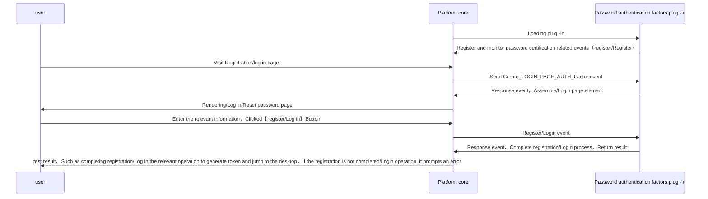
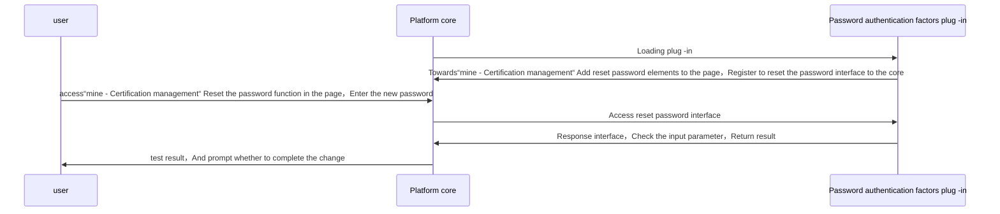
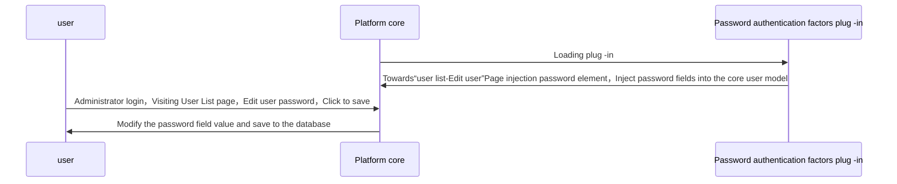

# Password authentication factors
## Features

User table extension password field，Allow users to certify through the user name and password，register。

general user：

* exist “mine - Certification management“ The function of adding a reset password
* exist “register” Page implementation user name and password registration
* exist “Log in” Page implementation user name password login

Tenant administrator

* exist”User Management - user list“The function of adding a reset password

## Configuration guide
## Configuration guide

=== "Plug -in lease"
    Enter through the menu bar on the left【Tenant management】->【Plug -in management】，Find the password authentication factor plug -in card in the plug -in lease page，Click to rent 
    

=== "Certification factor configuration"
    Enter through the menu bar on the left【Certification management】-> 【Authentication】,Click to create button，Type selection"password",Fill in related information，The configuration is completed 
    

=== "login interface"
    

=== "Registration interface"
    

=== "Change the password interface"
    Enter from the user avatar menu【Certification management】interface,Choose to change the password tab page 
    

## Implementation

general user：register/Log in：

general user：reset Password：

Administrator user： Reset the user password

## Abstract method implementation

* [load](#extension_root.com_longgui_auth_factor_mobile.MobileAuthFactorExtension.load)
* [authenticate](#extension_root.com_longgui_auth_factor_mobile.MobileAuthFactorExtension.authenticate)
* [register](#extension_root.com_longgui_auth_factor_mobile.MobileAuthFactorExtension.register)
* [reset_password](#extension_root.com_longgui_auth_factor_mobile.MobileAuthFactorExtension.reset_password)
* [create_login_page](#extension_root.com_longgui_auth_factor_mobile.MobileAuthFactorExtension.create_login_page)
* [create_register_page](#extension_root.com_longgui_auth_factor_mobile.MobileAuthFactorExtension.create_register_page)
* [create_password_page](#extension_root.com_longgui_auth_factor_mobile.MobileAuthFactorExtension.create_password_page)
* [create_other_page](#extension_root.com_longgui_auth_factor_mobile.MobileAuthFactorExtension.create_other_page)
* [create_auth_manage_page](#extension_root.com_longgui_auth_factor_mobile.MobileAuthFactorExtension.create_auth_manage_page)
* [check_auth_data](#extension_root.com_longgui_auth_factor_authcode.AuthCodeAuthFactorExtension.check_auth_data)
* [fix_login_page](#extension_root.com_longgui_auth_factor_authcode.AuthCodeAuthFactorExtension.fix_login_page)

## Code

::: extension_root.com_longgui_auth_factor_password.PasswordAuthFactorExtension
    rendering:
        show_source: true

