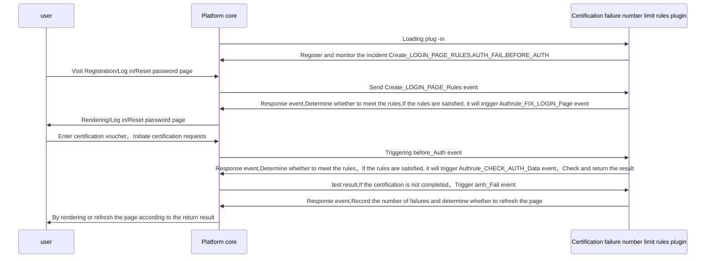

# Certification rules: Limited number of certification failure
## Features

After the number of failures of the user exceeds the limit of authentication，Expand the user certification voucher form，Insert secondary authentication factors，And when the user initiates the certification request again, the subordinate authentication factors are verified

## precondition

The number of certification failure limit rules plug -in require，The main authentication factor is to have login/register/Authentic factors for reset passwords and other main functions，The primary authentication factors are mainly authentication factors to supplement the authentication process through authentication rules，Taking the user name and password authentication factors and graphic verification code authentication factors as an example。

## Configuration guide

=== "Plug -in lease"
    Enter through the menu bar on the left【Tenant management】->【Plug -in management】，Find the number of authentication times in the plug -in lease page to limit the rules of the plug -in card，Click to rent 
    

=== "Certification rules configuration"
    Enter through the menu bar on the left【Certification management】-> 【Certification rules】,Click to create button，Type selection"retry_times",Choose the default password authentication factor of the main authentication factors，Select the default graphic verification code authentication factors for sub -authentication factors，The configuration is completed 
    

=== "Login interface"
    After the configuration is complete，When the user enters the login interface and repeats three times，The page will refresh and enable the graphics verification code 
    

## Implementation

* Certification rules: Limited number of certification failure：

## Abstract method implementation

* [load](#extension_root.com_longgui_auth_rule_retry_times.AuthRuleRetryTimesExtension.load)
* [check_rule](#extension_root.com_longgui_auth_rule_retry_times.AuthRuleRetryTimesExtension.authenticate)

## Code

::: extension_root.com_longgui_auth_rule_retry_times.AuthRuleRetryTimesExtension
    rendering:
        show_source: true

