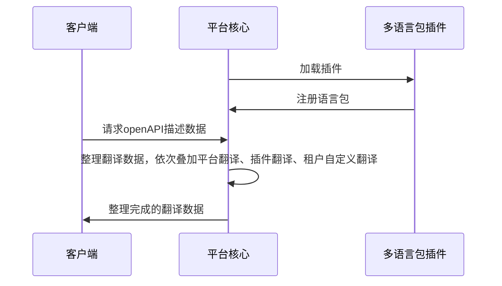

## Function introduction
The multilingual package plug-in implements the function of registering language translation data to arkid, and the developer only needs to provide the translated dictionary and the corresponding language name to complete the multilingual internationalization configuration function.
## Realize the idea
When developing a multilingual package plug-in, the developer only needs to inherit the multilingual plug-in base class and overload the language _ type and language _ data functions. The platform will integrate the data in the plug-in into the platform translation data, and distribute it to the front-end through the openapi description. The front-end page can obtain the corresponding data to complete the internationalization function.

<b>Note: </b> a language pack plug-in supports only one language translation data, and the priority is database custom translation data > plug-in translation data > platform built-in translation data.




Examples are as follows:

``` py
    class TranslationZhExtension(LanguageExtension):

        def language_type(self) -> str:
            return _("简体中文")
        
        def language_data(self) -> dict:
            return {
                "data":"数据"
            }
    
```
## Abstract function

* [language_type](#arkid.core.extension.language.LanguageExtension.language_type)
* [language_data](#arkid.core.extension.language.LanguageExtension.language_data)

## Base class definition

::: arkid.core.extension.language.LanguageExtension
    
## Examples

::: extension_root.com_longgui_language_zh.TranslationZhExtension
