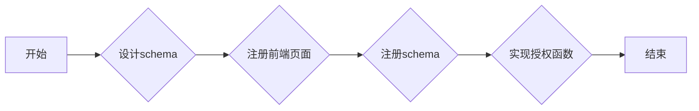

## Function introduction
Authorization rules, as a supplement to the existing authentication methods in the system, can support more fine-grained permission granting. Permissions can be granted according to different attributes of users, such as user name, nickname, gender, mobile phone number, etc. Permissions can also be granted to different attributes of the group. And accord to that requirement of a developer, the authorization unde a specific scene can be realized by expanding the structure of the data storage.
## Realize the idea
The arkid system has implemented a permission grant for user attributes by default, which is convenient for developers to refer to.

The following is a brief introduction to the implementation ideas:

1. Developers need to think clearly about the attributes that need to be filtered to develop their own plug-ins, whether they are user attributes, grouping attributes, or other attributes. And which application need to be filter, and which permissions.
The schema is designed to store the data structure. If some application lists, permission lists, user lists, etc. Are used in the schema, you need to register the used front-end pages separately using the [ register_front_pages ](#arkid.core.extension.impower_rule.ImpowerRuleBaseExtension.register_front_pages) parent class.

2. Different authorization rules are divided by different schemas, so when developers finish designing the schema, they need to register through [ register_impowerrule_schema ](#arkid.core.extension.impower_rule.ImpowerRuleBaseExtension.register_impowerrule_schema).

3. After the registration is completed, the green Type field of the authorization rule creation page will have an additional authorization rule, as shown in the following figure:

    

    If we choose different authorization rules, the red part will show different contents, which are determined by the schema structure.

    The creation, editing, and deletion of authorization rules are handled by arkid in advance, and developers only need to focus on the authorization method.
    
    The following is an introduction to the use of the weighting method:

    Developer is required to implement the [ get_auth_result(event, **kwargs) ](#arkid.core.extension.impower_rule.ImpowerRuleBaseExtension.get_auth_result) method

    1. Parameters: There are two parameters in `kwargs` `event` this method. We focus on `event` the parameter, which contains `data` two attributes, and `tenant`, in which `event.tenant` the current tenant can be obtained; The passed data `event.data` can be obtained. We get the value in data.
        1. The current user `data.user` can be obtained;
        2. The current application `data.app` can be obtained. If the application is None, it means that the application is arkid, otherwise, it is other applications;
        3. The user permission array `data.arr` can be obtained (composed of 0 or 1, 0 has no permission, 1 has permission, and the array subscript is the same as the sort _ ID in the database permission table);
        4. The current authorization rule `data.config` can be obtained
    2. Use: The developer needs to combine `data.user` according to the authorization rules `event.config`, filter according to his own needs, and return the sort _ ID array with permission.

## Abstract method
* [get_auth_result(event, **kwargs)](#arkid.core.extension.impower_rule.ImpowerRuleBaseExtension.get_auth_result)

## Base class definition

::: arkid.core.extension.impower_rule.ImpowerRuleBaseExtension

## Examples

::: extension_root.com_longgui_impower_rule.ImpowerRuleExtension