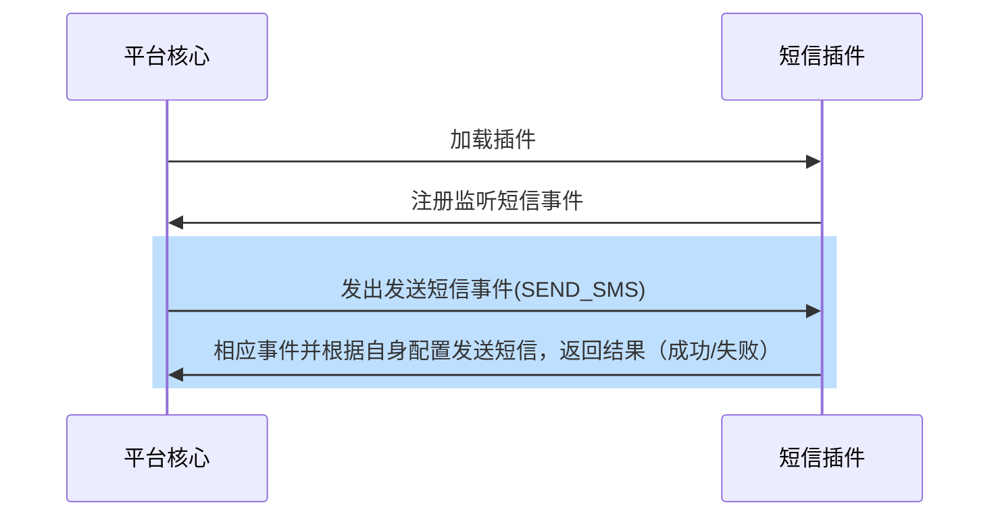

## Function introduction

The short message plug-in abstracts the process of short message sending requirements such as mobile phone verification code/notification in the authentication process, so that developers can access the short message services provided by major manufacturers through overloaded functions.

## Realize the idea
When developing a short message plug-in, a developer only needs to inherit the short message plug-in base class and overload the send _ SMS function, and the processing flow is as follows:

## Abstract function

* [send_sms](#arkid.core.extension.sms.SmsExtension.send_sms)

## Base class definition

::: arkid.core.extension.sms.SmsExtension
    
## Examples

::: extension_root.com_longgui_sms_aliyun.AliyunSMSExtension
