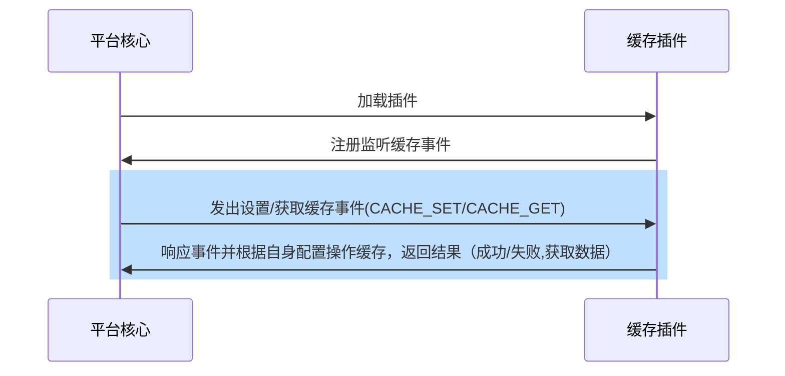

## Function introduction

Caching plug-ins provide caching functionality for the platform, that is, developers introduce caching databases such as redis through caching plug-ins and use them to complete caching transactions when they need caching support.

## Realize the idea
When developing a cache plug-in, the developer only needs to inherit the cache plug-in base class and overload the get/set function. The process is as follows:



## Cache usage method
Examples are as follows:
``` python

from arkid.common import cache #引入平台缓存

cache.set(tenant,key,value,expired) # 参数依次为：租户，缓存KEY, 缓存VALUE, 过期时间

cache.get(tenant,key) #参数依次为：租户，缓存KEY

```

## Abstract function

* [get](#arkid.core.extension.cache.CacheExtension.get)
* [set](#arkid.core.extension.cache.CacheExtension.set)

## Base class definition

::: arkid.core.extension.cache.CacheExtension
