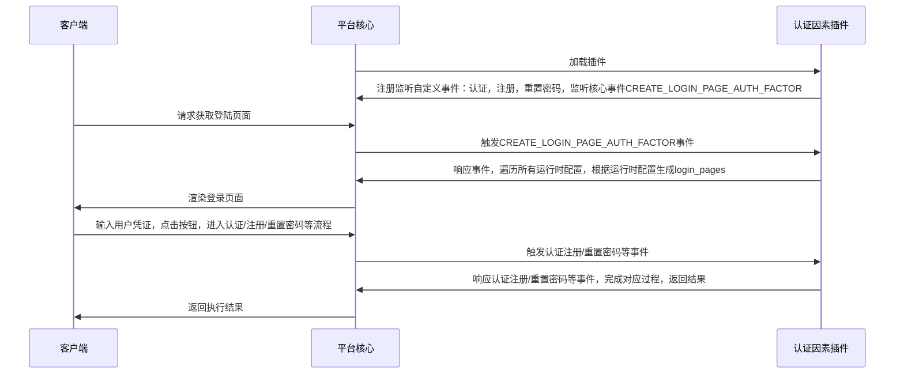

## Function introduction

Authentication factors: including a series of plug-ins with authentication or authentication assistance functions, such as SMS verification code, user name password, graphic verification code, etc., which are used to identify the user's identity or improve the system security.

## Realize the idea

When creating a new authentication factor, the developer needs to inherit the AuthFactor Extension base class and implement all abstract methods. The data flow of the authentication factor plug-in during operation is shown in the following figure:

## Abstract method

* [authenticate](#arkid.core.extension.auth_factor.AuthFactorExtension.authenticate)
* [register](#arkid.core.extension.auth_factor.AuthFactorExtension.register)
* [reset_password](#arkid.core.extension.auth_factor.AuthFactorExtension.reset_password)
* [create_login_page](#arkid.core.extension.auth_factor.AuthFactorExtension.create_login_page)
* [create_register_page](#arkid.core.extension.auth_factor.AuthFactorExtension.create_register_page)
* [create_password_page](#arkid.core.extension.auth_factor.AuthFactorExtension.create_password_page)
* [create_other_page](#arkid.core.extension.auth_factor.AuthFactorExtension.create_other_page)
* [create_auth_manage_page](#arkid.core.extension.auth_factor.AuthFactorExtension.create_auth_manage_page)

## Base class definition

::: arkid.core.extension.auth_factor.AuthFactorExtension
    
## Examples

::: extension_root.com_longgui_auth_factor_mobile.MobileAuthFactorExtension

::: extension_root.com_longgui_auth_factor_password.PasswordAuthFactorExtension