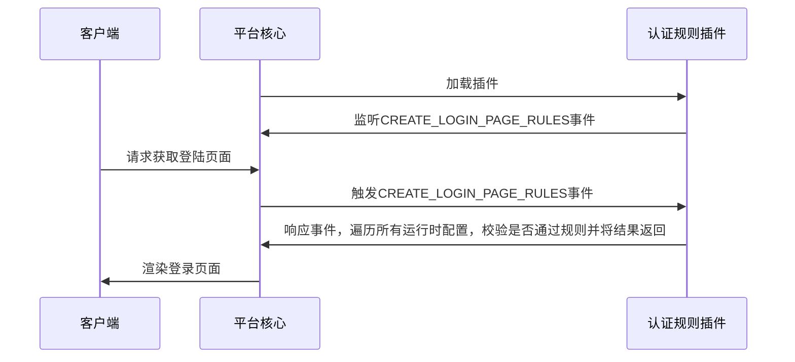

## Function introduction

The authentication rule is the extension of a series of authentication factors, which connects one or more authentication factors in series, and realizes the cooperation between authentication factors under specified conditions to complete the complex authentication process.

## Realize the idea
When developing authentication rule plug-ins, developers need to inherit the AuthRuleExtension base class and overload the check _ rule abstract method to monitor system events and connect authentication factors with the event mechanism. The basic process is as follows:

## Abstract function

* [check_rule](#arkid.core.extension.auth_rule.AuthRuleExtension.check_rule)

## Base class definition

::: arkid.core.extension.auth_rule.AuthRuleExtension
    
## Examples

::: extension_root.com_longgui_auth_rule_retry_times.AuthRuleRetryTimesExtension
