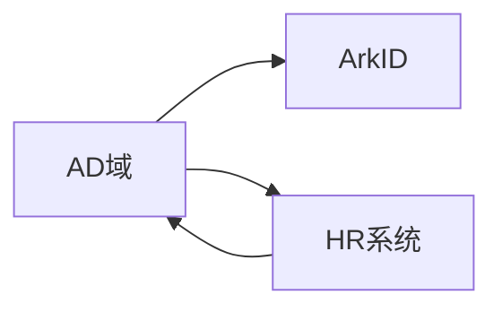

# 身份数据源

## SCIM数据同步

用户数据同步，使用SCIM标准协议。

该协议在主流的云平台中都得到支持。

一般来说，对接不同的系统需要不同的插件来支持。

系统默认自带ArkID的SCIM同步插件，支持client和server两种模式。

通过点击创建，来添加对应的插件配置。不同插件配置不同，请参见插件自己的文档。

通过ArkID，其它系统可以进行同步对接，而不用经过ArkID的数据库。

* 列表 点击菜单 "身份数据源>SCIM数据同步"

* 创建 点击菜单 "身份数据源>SCIM数据同步>创建"

* 编辑 点击菜单 "身份数据源>SCIM数据同步>选择记录>点击编辑"

* 删除 点击菜单 "身份数据源>SCIM数据同步>选择记录>点击删除"

## 权限数据同步

为了达到统一权限管理的目的，将权限数据同步也不失为一种方式。

ArkID自定义了一套标准数据模型来同步权限数据。对接其它的系统需要插件将各系统数据转化为此标准模型，然后写入ArkID中。或将该标准模型转化为其它系统中的数据。

与SCIM协议类似，同样支持其它系统的直接对接。
