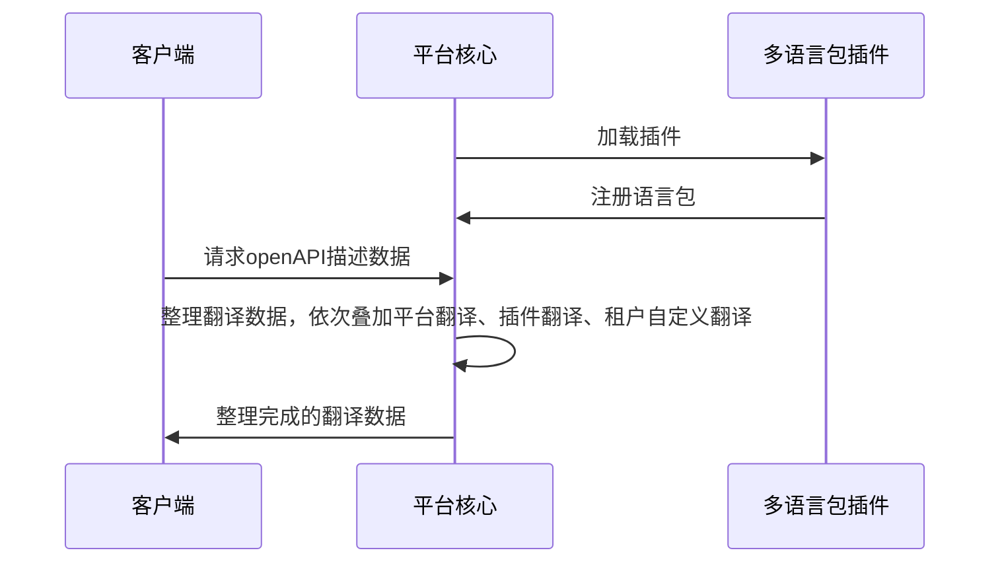

## 功能介绍
多语言包插件实现向arkid注册语言翻译数据功能，开发者仅需提供翻译完成后的字典和对应语言名称即可完成多语言国际化的配置功能。
## 实现思路
开发者在开发多语言包插件时，仅需继承多语言插件基类并重载language_type与language_data两个函数即可，平台会将插件中数据整合进平台翻译数据，通过openapi描述分发至前端，前端页面即可获取对应数据以完成国际化功能。

<b>注意:</b> 一个语言包插件仅支持一种语言翻译数据，同时优先级为 数据库自定义翻译数据 > 插件翻译数据 > 平台自带翻译数据




示例如下：

``` py
    class TranslationZhExtension(LanguageExtension):

        def language_type(self) -> str:
            return _("简体中文")
        
        def language_data(self) -> dict:
            return {
                "data":"数据"
            }
    
```
## 抽象函数

* [language_type](#arkid.core.extension.language.LanguageExtension.language_type)
* [language_data](#arkid.core.extension.language.LanguageExtension.language_data)

## 基类定义

::: arkid.core.extension.language.LanguageExtension
    rendering:
        show_source: true
    
## 示例

::: extension_root.com_longgui_language_zh.TranslationZhExtension
    rendering:
        show_source: true
