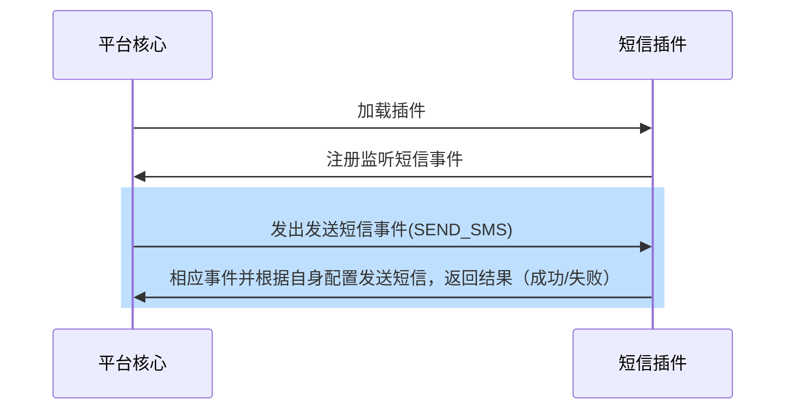

## 功能介绍

短信插件抽象处理认证过程中如手机验证码/通知等短信发送需求过程，以便于开发者通过重载函数方式接入各大厂商提供的短信服务

## 实现思路
开发者在开发短信插件时，仅需继承短信插件基类并重载send_sms函数即可，处理流程如下：

## 抽象函数

* [send_sms](#arkid.core.extension.sms.SmsExtension.send_sms)

## 基类定义

::: arkid.core.extension.sms.SmsExtension
    rendering:
        show_source: true
    
## 示例

::: extension_root.com_longgui_sms_aliyun.AliyunSMSExtension
    rendering:
        show_source: true
