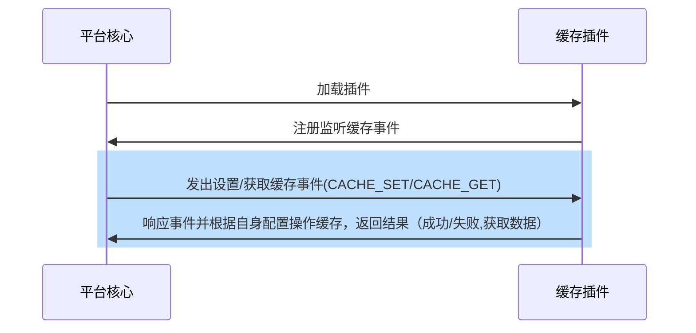

## 功能介绍

缓存插件为平台提供缓存功能，即开发者在需要缓存支持时通过缓存插件引入如redis等缓存数据库并使用它们完成缓存事务。

## 实现思路
开发者在开发缓存插件时，仅需继承缓存插件基类并重载get/set函数即可，处理流程如下：



## 缓存使用方法
示例如下：
``` python

from arkid.common import cache #引入平台缓存

cache.set(tenant,key,value,expired) # 参数依次为：租户，缓存KEY, 缓存VALUE, 过期时间

cache.get(tenant,key) #参数依次为：租户，缓存KEY

```

## 抽象函数

* [get](#arkid.core.extension.cache.CacheExtension.get)
* [set](#arkid.core.extension.cache.CacheExtension.set)

## 基类定义

::: arkid.core.extension.cache.CacheExtension
    rendering:
        show_source: true
