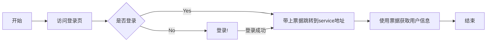

# CasServer

CAS是Central Authentication Service的缩写，中央认证服务。当用户访问CAS认证服务器，请求身份验证。CAS认证服务会检查用户是否登录。如果没登录就去登录，如果已经登录，CAS会发放一个一次性短时间的TGT票据，并重定向到开发者提供的service地址。然后，应用程序通过安全连接连接CAS，并提供自己的服务标识和验证票。之后CAS给出了关于特定用户的身份信息

整个认证过程如图所示:

## Cas认证

### 创建应用

=== "打开应用列表"
    
=== "新建Cas应用"
    
=== "在列表点击协议配置"
    
=== "选择类型为Cas并确认"
    
=== "在列表再次点击协议配置"
    
=== "保存登录和校验地址"
    

### 使用 Cas 应用
1.  将登录链接放在需要登录的第三方页面

    这里需要让用户通过链接访问arkid这边的统一认证。service参数是arkid认证完后的回调地址。

    http://localhost:9528/api/v1/tenant/4da114ce-e115-44a0-823b-d372114425d0/app/e78f117b-1632-42c9-8e3c-ec4fd796c89e/cas/login/?service=http://www.baidu.com

    页面会自动跳到进行登录

    http://localhost:9528/login?next=/api/v1/tenant/4da114ce-e115-44a0-823b-d372114425d0/app/e78f117b-1632-42c9-8e3c-ec4fd796c89e/cas/login/%3Fservice%3Dhttp%3A//www.baidu.com&tenant_id=4da114ce-e115-44a0-823b-d372114425d0

2. 登录成功后会取得一个票据

    https://www.baidu.com/?ticket=ST-1658743424-pvotuhaInoW1UGQlIlD1eLU6tZoMppu6

3. 通过校验地址获取用户信息

    一个票据只能用一次，service要和前面登录的相同，如果成功可以获取到用户信息

    

    如果你试图用已经使用过的票据就会返回

    

    需要每次登录先拿票据然后用票据换取用户信息