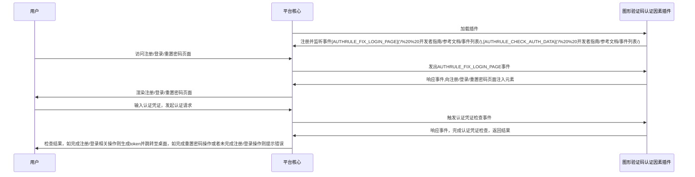

# 图形验证码认证因素
## 功能介绍

对用户认证凭证表单进行扩充，插入图形验证码并实现相关验证功能

<b>注意：图形验证码认证因素不具有认证/注册/修改密码等功能，仅对其他认证因素进行凭证元素扩充</b>

普通用户：

* 在 “登录” 页面实现向指定表单插入图形验证码

## 配置指南

## 实现思路

* 普通用户：图形验证码：

## 抽象方法实现
* [load](#extension_root.com_longgui_auth_factor_authcode.AuthCodeAuthFactorExtension.load)
* [authenticate](#extension_root.com_longgui_auth_factor_authcode.AuthCodeAuthFactorExtension.authenticate)
* [register](#extension_root.com_longgui_auth_factor_authcode.AuthCodeAuthFactorExtension.register)
* [reset_password](#extension_root.com_longgui_auth_factor_authcode.AuthCodeAuthFactorExtension.reset_password)
* [create_login_page](#extension_root.com_longgui_auth_factor_authcode.AuthCodeAuthFactorExtension.create_login_page)
* [create_register_page](#extension_root.com_longgui_auth_factor_authcode.AuthCodeAuthFactorExtension.create_register_page)
* [create_password_page](#extension_root.com_longgui_auth_factor_authcode.AuthCodeAuthFactorExtension.create_password_page)
* [create_other_page](#extension_root.com_longgui_auth_factor_authcode.AuthCodeAuthFactorExtension.create_other_page)
* [create_auth_manage_page](#extension_root.com_longgui_auth_factor_authcode.AuthCodeAuthFactorExtension.create_auth_manage_page)

## 代码

::: extension_root.com_longgui_auth_factor_authcode.AuthCodeAuthFactorExtension
    rendering:
        show_source: true

