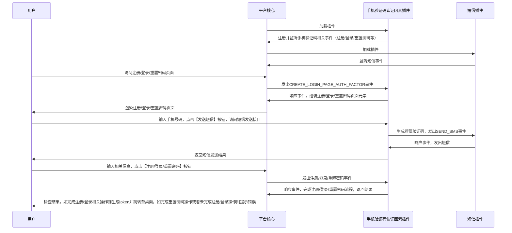
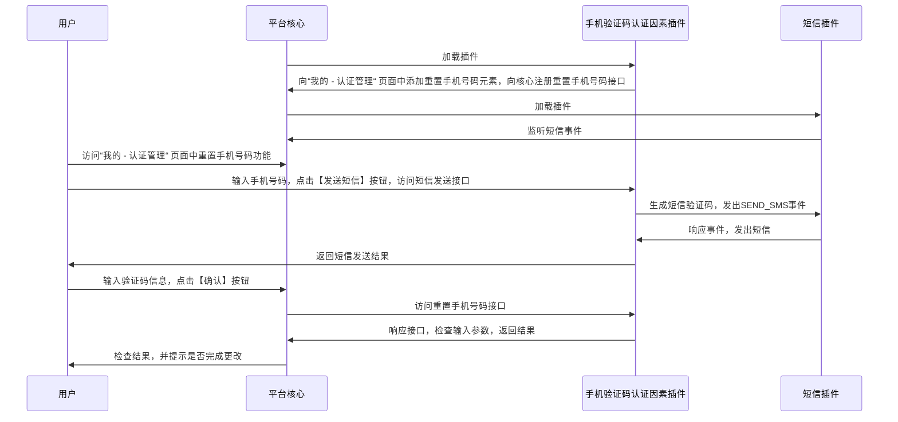
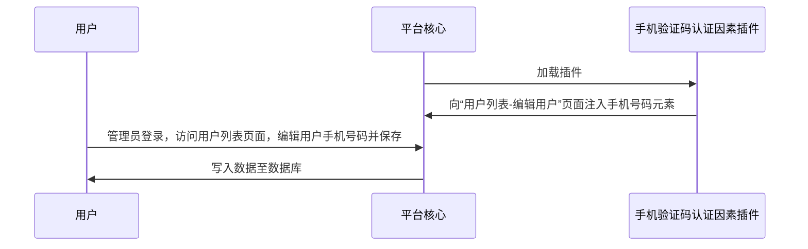

# 手机验证码认证因素
## 功能介绍

对用户表扩展手机号码字段，允许用户通过手机号码与验证码的方式进行认证，注册，重置密码以及更换手机号。

普通用户：

* 在 “注册” 页面实现手机号码+验证码用户注册
* 在 “登录” 页面实现手机号码+验证码用户登录
* 在 “更改密码” 页面实现手机号码+验证码方式下密码更改
* 在 “我的 - 认证管理“ 中添加重置手机号码的功能

租户管理员

* 在”用户管理 - 用户列表“中编辑页面添加手机号码编辑功能

## 配置指南

## 实现思路

* 普通用户：手机号码+验证码用户注册/登录/重置密码：

* 普通用户：重置手机号码：

* 管理员用户： 更换用户手机号码

## 抽象方法实现
* [load](#extension_root.com_longgui_auth_factor_mobile.MobileAuthFactorExtension.load)
* [authenticate](#extension_root.com_longgui_auth_factor_mobile.MobileAuthFactorExtension.authenticate)
* [register](#extension_root.com_longgui_auth_factor_mobile.MobileAuthFactorExtension.register)
* [reset_password](#extension_root.com_longgui_auth_factor_mobile.MobileAuthFactorExtension.reset_password)
* [create_login_page](#extension_root.com_longgui_auth_factor_mobile.MobileAuthFactorExtension.create_login_page)
* [create_register_page](#extension_root.com_longgui_auth_factor_mobile.MobileAuthFactorExtension.create_register_page)
* [create_password_page](#extension_root.com_longgui_auth_factor_mobile.MobileAuthFactorExtension.create_password_page)
* [create_other_page](#extension_root.com_longgui_auth_factor_mobile.MobileAuthFactorExtension.create_other_page)
* [create_auth_manage_page](#extension_root.com_longgui_auth_factor_mobile.MobileAuthFactorExtension.create_auth_manage_page)

## 代码

::: extension_root.com_longgui_auth_factor_mobile.MobileAuthFactorExtension
    rendering:
        show_source: true

::: extension_root.com_longgui_auth_factor_mobile.sms
    rendering:
        show_source: true

