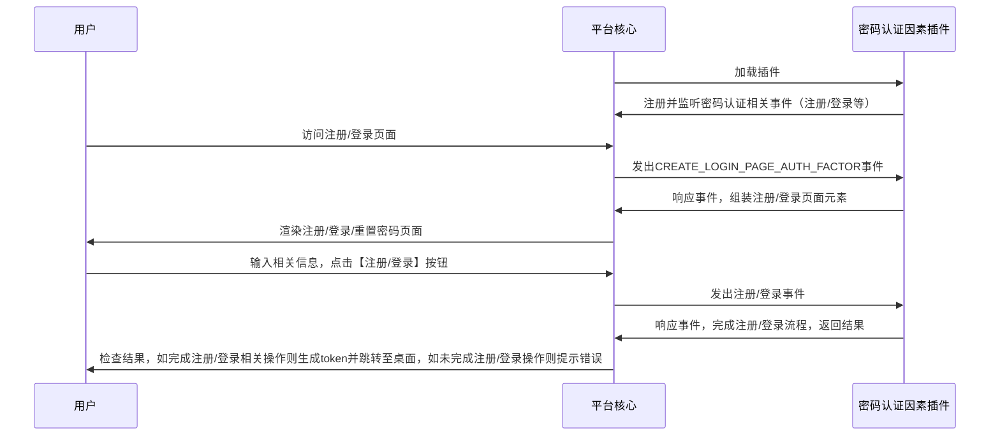
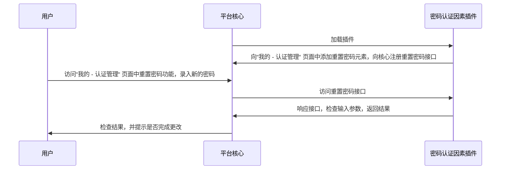
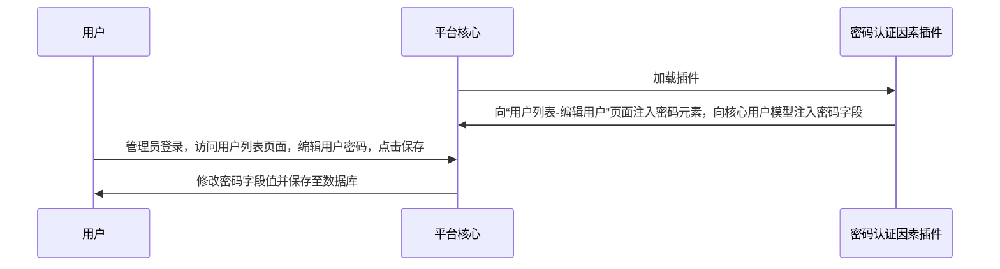

# 密码认证因素
## 功能介绍

对用户表扩展密码字段，允许用户通过用户名与密码的方式进行认证，注册。

普通用户：

* 在 “我的 - 认证管理“ 中添加重置密码的功能
* 在 “注册” 页面实现用户名密码注册
* 在 “登录” 页面实现用户名密码登录

租户管理员

* 在”用户管理 - 用户列表“中添加重置密码的功能

## 配置指南
## 配置指南

=== "插件租赁"
    经由左侧菜单栏依次进入【租户管理】->【插件管理】，在插件租赁页面中找到密码认证因素插件卡片，点击租赁
    

=== "认证因素配置"
    经由左侧菜单栏依次进入【认证管理】-> 【认证因素】,点击创建按钮，类型选择"password",填入相关信息，至此配置完成
    

=== "登录界面"
    

=== "注册界面"
    

=== "更改密码界面"
    由用户头像菜单进入【认证管理】界面,选择更改密码标签页
    

## 实现思路

普通用户：注册/登录：

普通用户：重置密码：

管理员用户： 重置用户密码

## 抽象方法实现

* [load](#extension_root.com_longgui_auth_factor_mobile.MobileAuthFactorExtension.load)
* [authenticate](#extension_root.com_longgui_auth_factor_mobile.MobileAuthFactorExtension.authenticate)
* [register](#extension_root.com_longgui_auth_factor_mobile.MobileAuthFactorExtension.register)
* [reset_password](#extension_root.com_longgui_auth_factor_mobile.MobileAuthFactorExtension.reset_password)
* [create_login_page](#extension_root.com_longgui_auth_factor_mobile.MobileAuthFactorExtension.create_login_page)
* [create_register_page](#extension_root.com_longgui_auth_factor_mobile.MobileAuthFactorExtension.create_register_page)
* [create_password_page](#extension_root.com_longgui_auth_factor_mobile.MobileAuthFactorExtension.create_password_page)
* [create_other_page](#extension_root.com_longgui_auth_factor_mobile.MobileAuthFactorExtension.create_other_page)
* [create_auth_manage_page](#extension_root.com_longgui_auth_factor_mobile.MobileAuthFactorExtension.create_auth_manage_page)
* [check_auth_data](#extension_root.com_longgui_auth_factor_authcode.AuthCodeAuthFactorExtension.check_auth_data)
* [fix_login_page](#extension_root.com_longgui_auth_factor_authcode.AuthCodeAuthFactorExtension.fix_login_page)

## 代码

::: extension_root.com_longgui_auth_factor_password.PasswordAuthFactorExtension
    rendering:
        show_source: true

