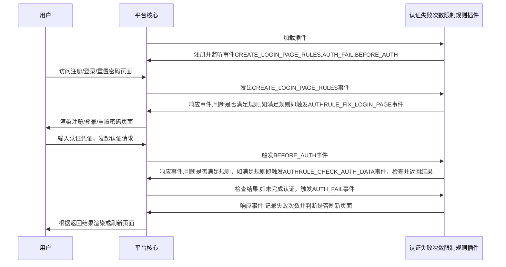

# 认证规则: 认证失败次数限制
## 功能介绍

在用户超出限制认证失败次数后，对用户认证凭证表单进行扩充，插入次级认证因素，并在用户再次发起认证请求时进行次级认证因素校验

## 前置条件

认证失败次数限制规则插件中需要至少一个主认证因素插件和一个次认证因素插件支持，主认证因素即为拥有登录/注册/重置密码等主要功能的认证因素，次认证因素为主认证因素通过认证规则限制对认证过程进行补充，此处以用户名密码认证因素与图形验证码认证因素为例。

## 配置指南

=== "插件租赁"
    经由左侧菜单栏依次进入【租户管理】->【插件管理】，在插件租赁页面中找到认证次数限制规则插件卡片，点击租赁
    

=== "认证规则配置"
    经由左侧菜单栏依次进入【认证管理】-> 【认证规则】,点击创建按钮，类型选择"retry_times",主认证因素选择默认密码认证因素，次认证因素选择默认的图形验证码认证因素，至此配置完成
    

=== "登陆界面"
    配置完成后，当用户进入登陆界面并重复失败三次后，页面会刷新并启用图形验证码
    

## 实现思路

* 认证规则: 认证失败次数限制：

## 抽象方法实现

* [load](#extension_root.com_longgui_auth_rule_retry_times.AuthRuleRetryTimesExtension.load)
* [check_rule](#extension_root.com_longgui_auth_rule_retry_times.AuthRuleRetryTimesExtension.authenticate)

## 代码

::: extension_root.com_longgui_auth_rule_retry_times.AuthRuleRetryTimesExtension
    rendering:
        show_source: true

