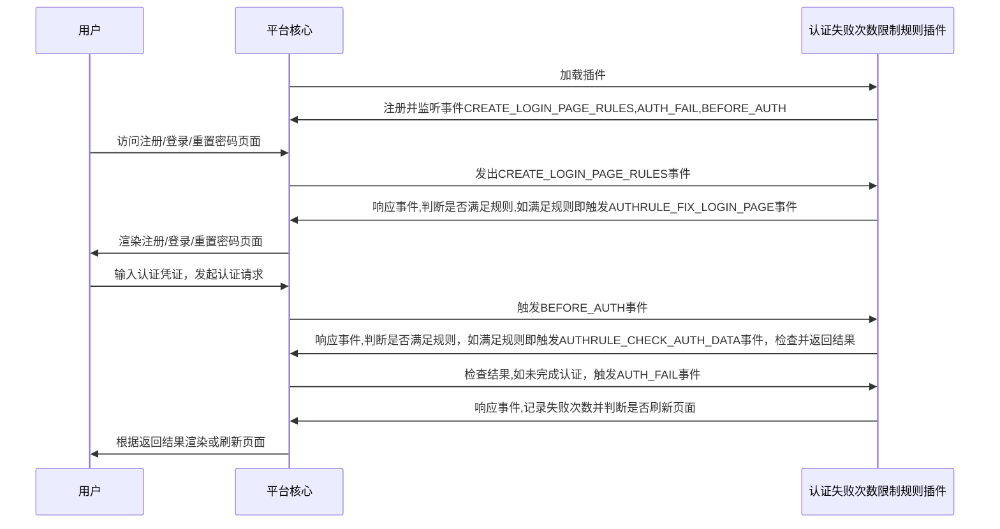

# 认证规则: 认证失败次数限制
## 功能介绍

在用户超出限制认证失败次数后，对用户认证凭证表单进行扩充，插入次级认证因素，并在用户再次发起认证请求时进行次级认证因素校验

## 配置指南

## 实现思路

* 认证规则: 认证失败次数限制：

## 抽象方法实现
* [load](#extension_root.com_longgui_auth_rule_retry_times.AuthRuleRetryTimesExtension.load)
* [check_rule](#extension_root.com_longgui_auth_rule_retry_times.AuthRuleRetryTimesExtension.authenticate)

## 代码

::: extension_root.com_longgui_auth_rule_retry_times.AuthRuleRetryTimesExtension
    rendering:
        show_source: true

